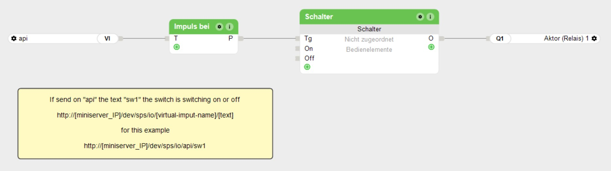

# loxklipper

[](#)
[](#)
[](#)
[](#)
[](LICENSE)
[](https://www.paypal.com/donate/?hosted_button_id=6CDEVZGJWTNQQ)

A Klipper extras module that lets a 3D printer switch things in a **Loxone** home automation system straight from G-code. Define one `[loxone ...]` block per thing you want to switch, then put `LOXONE NAME=<target>` in a macro or in your slicer's start/end G-code. The module assembles the Miniserver URL, sends the request with HTTP Basic authentication, reports the reply in the console. A `wait_time` delays the request by a configured number of seconds, so `LOXONE NAME=tv` in your start G-code can switch something on two minutes into the print rather than at once.

Nothing about it is tied to the printer: it is a plain HTTP call to the Miniserver's web service, so anything you can wire behind a Virtual Text Input in Loxone Config is fair game — lights, a TV, an extractor fan, a notification. The request runs in a worker thread so it never stalls Klipper's event loop, and a Miniserver that is switched off or unreachable does not abort your print unless you ask it to.

## Features

- **Several targets** — one `[loxone <name>]` section per thing to switch, all reachable through a single `LOXONE NAME=<name>` command
- **Assembles the URL for you** — IP, Virtual Text Input name and text go in as separate options; no hand-built URLs to get wrong
- **Basic authentication** — user and password are base64-encoded into the `Authorization` header, done once at startup
- **Non-blocking** — the HTTP call runs in a worker thread while Klipper's reactor keeps servicing the MCU
- **Temperature guard** — `nozzle: 60` holds the request back until the hotend has cooled below 60 °C; `bed:` does the same for the bed
- **Delayed sending** — `wait_time` fires the request N seconds *after* the guard opens, by default without holding up the print; overridable per call with `WAIT=`
- **Override per call** — `VALUE=` sends a different text through the same target, so on and off need one section, not two
- **Chooses how to fail** — `on_error: log` (default), `pause` the print, or `abort` it
- **Retries** — `retries: N` re-sends after a network hiccup
- **Test without the printer** — `tools/loxone_send.py` fires the same config section from a shell
- **Auto-updates** — ships a Moonraker `[update_manager]` block; the installer adds it for you
- **No dependencies** — Klipper's Python environment has no `requests`, so this uses only the standard library

## Requirements

- Klipper on Python 3.7 or newer (any current installation)
- A Loxone Miniserver reachable from the printer host
- A Loxone user allowed to use the web service
- Moonraker, if you want auto-updates — optional, the module works without it

## Setting up the Loxone side

The endpoint this module uses pushes a **text** into the Miniserver, so it needs a **Virtual Text Input**. A plain virtual input will not do — that one takes a numeric value and the URL below would not reach it.



A ready-made project with exactly this wiring is in [`docs/example.Loxone`](docs/example.Loxone) — open it in Loxone Config to look around. The screenshot above is a German Loxone Config, so the German labels are given below alongside the English ones.

1. In **Loxone Config**, go to **Periphery → Virtual Inputs** (*Peripherie → Virtuelle Eingänge*) and create a **Virtual Text Input** (*Virtueller Texteingang*). In the example it is called **`api`**.
2. That name is what goes into **`vi_name`**, character for character — it becomes part of the URL. Keep it short and free of spaces and umlauts and you never have to think about percent-encoding.
3. Drag in a **Pulse At** block (*Impuls bei*) and connect the text input's **VI** output to its **T** input. Set the block's text to the value you intend to send — **`sw1`** in the example. That value is what goes into **`text_send`**. The block emits a pulse on **P** whenever the arriving text matches it.
4. Wire **P** into whatever you want to trigger. The example feeds the **Tg** (toggle) input of a **Switch** (*Schalter*), whose output drives relay **Q1**.
5. Save the program to the Miniserver.

The resulting request is

```
POST http://<loxone_ip>/dev/sps/io/<vi_name>/<text_send>
Authorization: Basic <base64 of user:password>
```

so the example project answers to `http://192.168.1.10/dev/sps/io/api/sw1`, which in `printer.cfg` is `vi_name: api` and `text_send: sw1`.

## Order of a call

```
LOXONE NAME=…  →  temperature guard  →  wait_time  →  HTTP POST
                  (nozzle / bed)        (seconds)
```

Both stages are optional. With neither configured the request goes out immediately and the console reports the result straight away.

Two things about this wiring are worth knowing before you copy it:

- **`Tg` is a toggle, so sending `sw1` twice switches on and then off again.** Convenient for a test, awkward for a print — if a print aborts between the two calls, the relay stays on. For a deterministic on and off, use two texts (`sw1_on`, `sw1_off`), give each its own **Pulse At** block, and wire them into the switch's **On** and **Off** inputs instead of **Tg**. One `[loxone ...]` section still covers both, because `VALUE=` overrides the text per call.
- **One text input can drive any number of these.** Hang several **Pulse At** blocks off the same **VI** output, each matching a different text, and one `[loxone ...]` section plus `VALUE=` reaches all of them.

## Installation

```bash
cd ~
git clone https://github.com/sorglos-it/loxklipper.git
cd loxklipper
bash install.sh
```

The installer links `extras/loxone.py` into `~/klipper/klippy/extras/`, appends the Moonraker update block to `moonraker.conf` (keeping a `.loxklipper.bak` beside it), and restarts Klipper if it can do so without asking for a password. It is safe to run again and never prompts, because Moonraker re-runs it unattended after every update.

If Klipper does not live in `~/klipper`, point the installer at it:

```bash
KLIPPER_PATH=/opt/klipper bash install.sh
```

Clone rather than copying the folder from a Windows machine — a copy carries CRLF line endings along and `install.sh` then dies with `/bin/bash^M: bad interpreter`. Already hit it? `sed -i 's/\r$//' install.sh`.

Removing it again:

```bash
bash ~/loxklipper/uninstall.sh
```

## Configuration

One section per thing you want to switch. The section name is what `LOXONE NAME=` refers to.

```ini
[loxone printer_light]
loxone_ip: 192.168.1.10
user: klipper
password: changeme
vi_name: api            # name of the Virtual Text Input
text_send: sw1          # text the "Pulse At" block matches
wait_time: 0
```

| Option | Default | Meaning |
|---|---|---|
| `loxone_ip` | *required* | Miniserver host or IP. A non-standard port goes here as `192.168.1.10:8080`. Aliases: `loxoneIP`, `host` |
| `user` | *required* | Loxone user allowed to use the web service. Alias: `username` |
| `password` | *required* | That user's password, in plain text — read the caveats. Alias: `passwort` |
| `vi_name` | *required* | Name of the Virtual Text Input in Loxone Config. Alias: `viName` |
| `text_send` | *required* | Text pushed into that input; must match what the **Pulse At** block behind it expects. Alias: `textSend` |
| `nozzle` | *off* | Hold the request until the extruder is **below** this temperature in °C. Alias: `nozzel` |
| `bed` | *off* | Same for `heater_bed` |
| `wait_time` | `0` | Seconds to wait **before** the request is sent, counted from when the temperature guard opens. `0` sends as soon as the guard is clear. Alias: `waittime` |
| `wait_mode` | `defer` | `defer` lets the print continue during the wait; `block` holds the G-code stream until the request has gone out |
| `protocol` | `http` | `http` or `https` |
| `verify_certificate` | `True` | HTTPS only. `False` skips certificate checking for a self-signed Miniserver certificate |
| `method` | `POST` | HTTP method |
| `timeout` | `5` | Seconds allowed per attempt |
| `retries` | `0` | Extra attempts after a failure, one second apart |
| `on_error` | `log` | `log` reports and carries on, `pause` runs `PAUSE`, `abort` raises a G-code error |

Option names are case-insensitive and the camelCase spellings above are accepted, because Klipper lower-cases every option name before a module sees it. `loxoneIP` and `loxone_ip` are the same option; pick one style and stay with it.

[`docs/example-printer.cfg`](docs/example-printer.cfg) has a fuller set including macro examples.

## Commands

| Command | Effect |
|---|---|
| `LOXONE NAME=<target>` | Wait the target's `wait_time`, then send its configured text |
| `LOXONE NAME=<target> VALUE=<text>` | Send a different text through the same target |
| `LOXONE NAME=<target> WAIT=<seconds>` | Override `wait_time` for this call; `WAIT=0` sends at once |
| `LOXONE_CANCEL [NAME=<target>]` | Drop scheduled calls that have not been sent yet |
| `LOXONE_LIST` | List the configured targets with the URL each one would call |

In a macro:

```ini
[gcode_macro PRINT_START]
gcode:
    LOXONE NAME=printer_light
    LOXONE NAME=workshop_fan

[gcode_macro PRINT_END]
gcode:
    LOXONE NAME=workshop_fan VALUE=WS-FAN-OFF
    LOXONE NAME=printer_light VALUE=light_off
```

## Testing without the printer

`tools/loxone_send.py` reads the same `[loxone ...]` sections and fires one from a shell, so you can check credentials and the Virtual Text Input name before restarting Klipper:

```bash
python3 ~/loxklipper/tools/loxone_send.py ~/printer_data/config/printer.cfg
python3 ~/loxklipper/tools/loxone_send.py ~/printer_data/config/printer.cfg printer_light --dry-run
python3 ~/loxklipper/tools/loxone_send.py ~/printer_data/config/printer.cfg printer_light
```

It needs nothing but Python 3 — no Klipper, no Moonraker — and it explains the common HTTP failures (401 credentials, 404 unknown text input, 405 wrong method) instead of just printing the code.

## Auto-updates

The installer adds this to `moonraker.conf`; see [`docs/example-moonraker.conf`](docs/example-moonraker.conf).

```ini
[update_manager loxklipper]
type: git_repo
path: ~/loxklipper
origin: https://github.com/sorglos-it/loxklipper.git
primary_branch: main
managed_services: klipper
install_script: install.sh
```

Restart Moonraker once after it appears, then loxklipper shows up alongside Klipper and Moonraker in Mainsail's or Fluidd's update panel. The installer restarts Moonraker for you when it added the block and can use `sudo` without a password.

### It does not show up in Mainsail

Work down this list — it is ordered by how often each one is the answer.

1. **`install.sh` never ran on the printer.** Pushing the repository to GitHub changes nothing on the Pi. `git clone` it there and run the installer.
2. **Moonraker has not restarted since the block was added.** Moonraker reads `moonraker.conf` only at startup, so a new entry stays invisible until then: `sudo systemctl restart moonraker`.
3. **The folder is not a git clone.** A ZIP download has no `.git`, and Moonraker drops a `git_repo` entry without one — the module still works, the update entry never appears. Re-clone it. Current versions of `install.sh` warn about this.
4. **`moonraker.conf` is somewhere the installer did not look.** It checks `~/printer_data/config`, `~/klipper_config` and `~/config`; anywhere else needs `KLIPPER_CONFIG=/path/to/config bash install.sh`.
5. **`path:` no longer matches where the clone lives.** The installer writes the real path it found; moving the folder afterwards breaks the entry.
6. **Moonraker rejected the entry and said why** — this is the one to check when the first five look fine:

```bash
grep -i loxklipper ~/printer_data/logs/moonraker.log | tail -20
```

A frequent culprit there is git's *dubious ownership* error, from cloning as root while Moonraker runs as `pi`. Fix it with `sudo chown -R pi:pi ~/loxklipper`.

What Moonraker itself thinks it has, regardless of what the UI draws:

```bash
curl -s localhost:7125/machine/update/status | python3 -m json.tool | grep -i loxklipper
```

## How it works

`[loxone <name>]` is a Klipper config prefix, so each section builds one `LoxoneTarget`. The first one created also registers the shared `LOXONE` and `LOXONE_LIST` commands and puts a dispatcher on the printer object; every later section registers itself with that dispatcher. This is why ten targets still give you one command rather than ten.

When `LOXONE` runs with no wait, the target percent-encodes `vi_name` and the text into the path, hands the request to a worker thread, and polls that thread through `reactor.pause()` in 50 ms slices. That detail is the whole point of the design: a blocking socket call in Klipper's main thread stops MCU communication for the length of the timeout and can end in a `Timer too close` shutdown mid-print.

With a `wait_time` in the default `defer` mode the command returns straight away and the send is put on a Klipper reactor timer. Two long-lived timers per target drive it — one to fire due calls, one to collect finished requests — re-armed with `update_timer` rather than registered per call, so a print with hundreds of `LOXONE` calls does not leave hundreds of dead timers behind. `wait_mode: block` instead holds the G-code stream in a `reactor.pause()` loop, in one-second slices, breaking out if the printer shuts down underneath it.

Failures land in `_handle_failure`, which logs to `klippy.log`, echoes to the console with a `!!` prefix, and then does whatever `on_error` says.

## Temperature guard

`nozzle: 60` holds a call back until the hotend has cooled below 60 °C — useful when the thing being switched should not happen while the printer is still hot, for instance cutting power to the printer's socket or shutting down an enclosure fan.

```ini
[loxone printer_socket]
loxone_ip: 192.168.1.10
user: klipper
password: changeme
vi_name: api
text_send: socket_off
nozzle: 60          # only once the hotend is below 60 °C
bed: 50             # and the bed below 50 °C
wait_time: 30       # then wait another 30 s, then send
```

The guard runs **before** `wait_time`, so the 30 s above start counting the moment the printer is cool enough, not when the G-code line was reached. Every configured limit has to be satisfied at once.

Two properties worth knowing, both deliberate:

- **The guard has no timeout.** If the printer never cools below the limit — because a next print reheats it — the call simply never goes out. For a safety guard that is the right failure direction. `LOXONE_LIST` shows what is still held, `LOXONE_CANCEL` clears it. In `wait_mode: block` the same situation holds the G-code stream indefinitely, exactly as Klipper's own `TEMPERATURE_WAIT` does.
- **A stale sensor does not count as cold.** Klipper's `get_temp()` returns `0.0` when the last reading is more than about five seconds old, which for a guard is the dangerous direction — a hung sensor would look like a cold nozzle. The guard therefore requires three consecutive readings below the limit before it opens, so a single stale `0.0` cannot release it. Anything it cannot read at all (missing heater, exception) counts as too hot.

A heater name that does not exist is a **startup error**, not a warning. The guard fails safe by never opening, and a silent never-switching call is far harder to notice than a printer that refuses to start.

## Notes & caveats

- **Your Loxone password sits in `printer.cfg` in plain text.** Mainsail and Fluidd show that file in their config editor, Moonraker serves it over the network, and it ends up in every config backup and in `git` if you version your config. Base64 is encoding, not encryption — anyone who reads the file has the password. Create a **dedicated Loxone user** with only the rights this needs, and do not reuse an admin password.
- **The temperature guard is not a substitute for Klipper's own thermal protection.** It decides when an HTTP request goes out, nothing more. It does not turn heaters off, does not monitor for thermal runaway, and cannot stop anything on the printer. If you use it to cut mains power to the printer, that power switch is outside Klipper's control entirely — think through what happens if the request is delayed, lost, or fires while a second print has already started.
- **`wait_time` delays the request, it does not run after it.** `LOXONE NAME=tv` with `wait_time: 120` returns immediately, the print carries on, and the POST goes out two minutes later. The console says `scheduled in 120s` at the call and reports the HTTP result when it actually fires, so two messages per call is normal.
- **`wait_mode: block` does stop the toolhead with a hot nozzle.** In that mode the wait holds the G-code stream, the move queue drains, and the printer sits still for the duration — a `wait_mode: block` with `wait_time: 120` mid-print will leave a blob or a burnt patch. That is why `defer` is the default. If you do want `block` mid-print, park and retract first; `docs/example-printer.cfg` has a macro that does.
- **The delay is counted from when the line is parsed, not from when the toolhead gets there.** Klipper reads ahead of the motion queue, so a `LOXONE` call in the middle of a print starts its countdown slightly before the nozzle reaches the matching point in the model. For "switch the light on at layer 30" that is irrelevant; for anything that must be frame-accurate it is not.
- **A scheduled call survives the end of the print, but not a restart.** It is held on a Klipper reactor timer, so it still fires after the print finishes — which is usually the point. A `FIRMWARE_RESTART`, an emergency stop or a Klipper restart drops everything still pending, silently. `LOXONE_LIST` shows what is queued; `LOXONE_CANCEL` clears it deliberately.
- **In `block` mode, `M112` still works during the wait but `CANCEL_PRINT` queues behind it.** Emergency stop is handled out of band and breaks the wait loop through the shutdown check. A normal cancel is an ordinary G-code command and waits its turn, so it only takes effect once the wait expires. In the default `defer` mode neither is blocked, because the G-code stream was never held.
- **`on_error: abort` cannot abort a deferred call.** By the time a scheduled request fails, the G-code command that started it has long finished, so there is nothing left to raise into. It falls back to `pause` there. In `block` mode and with `wait_time: 0` it aborts as documented.
- **POST is the default because it was asked for; Loxone documents these endpoints as GET.** POST works against current firmware. If your Miniserver answers `405 Method Not Allowed`, set `method: GET` — nothing else changes.
- **`on_error: log` means a dead Miniserver does not stop your print.** That is the default on purpose. If the switching matters more than the print, use `abort`; `pause` needs `[pause_resume]` configured, and says so in the console instead of failing silently if it is missing.
- **`verify_certificate: False` turns off TLS verification completely** for that target — not just the hostname check. It is the right setting for a Miniserver with a self-signed certificate on your own LAN and the wrong one over the open internet.
- **A wrong text is not an error.** The Miniserver accepts any text into the input and answers `200`; only the **Pulse At** block decides whether anything happens. So a typo in `text_send` looks like a success in the Klipper console and switches nothing. `LOXONE_LIST` prints the exact URL each target calls — compare it against the block in Loxone Config.
- **Spaces and umlauts in `vi_name` or `text_send` are percent-encoded, `/` is not.** A slash is left alone so you can address deeper paths on purpose. If a name genuinely contains a slash, this module will not encode it for you.
- **Klipper's Python environment has no `requests`.** Only what ships with Python is available, so this uses `urllib.request`: no connection pooling, no HTTP/2, one fresh connection per call. At the rate G-code fires these, that costs nothing.
- **The symlink shows up as an untracked file in Klipper's git repository.** Every Klipper plugin installed this way does this. It does not block Klipper updates, but `git status` in `~/klipper` will mention `klippy/extras/loxone.py`.
- **Target names are compared case-insensitively** and a duplicate is refused at startup, so `[loxone tv]` and `[loxone TV]` cannot both exist. A name containing spaces works but then needs quoting at the command line, which is a good reason not to use one.
- **The installer will not run as root.** Installing as root leaves a symlink and a `moonraker.conf` that the Klipper user cannot manage.

## Development

The module is a single file, `extras/loxone.py`, symlinked into `klippy/extras/`. Editing it in the clone and restarting Klipper is the whole edit-test loop:

```bash
sudo systemctl restart klipper
tail -f ~/printer_data/logs/klippy.log
```

Every request is logged there as `loxklipper: POST <url> (target '<name>')`; the `Authorization` header is never logged. For faster iteration, `tools/loxone_send.py` exercises the same URL assembly and authentication without restarting anything.

## Support this project ❤️

If this saved you time, you can support further development:

[](https://www.paypal.com/donate/?hosted_button_id=6CDEVZGJWTNQQ)

**[➡️ Donate via PayPal](https://www.paypal.com/donate/?hosted_button_id=6CDEVZGJWTNQQ)**

## License

This project is licensed under the [MIT License](LICENSE) — © 2026 Thomas Weirich.
